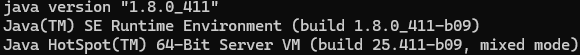

# dio-java-basico

Repositório para armazenar todo conteúdo do curso de Java Básico.

Plataformas de ambiente de desenvolvimento Java

- VSCode
- Eclipse
- Intellij

## Configuração de ambiente

- Verificando se você não tem o JDK instalado em sua máquina:

Abra um terminal/cmd e execute o seguinte comando:
java -version

Caso seu ambiente tenha o JDK instalado aparecerá o seguinte resultado:
